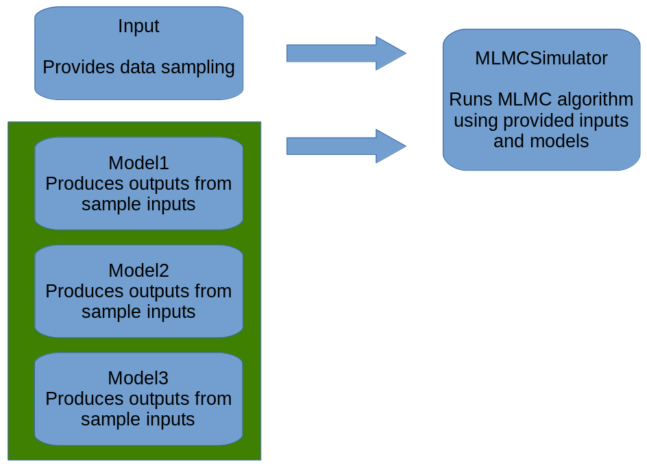

Introduction
=============

MLMCPy is an implementation of the Multi-Level Monte Carlo (MLMC) method in Python. It is a software package developed to enable user-friendly utilization of the Multi-Level Monte Carlo (MLMC) approach for uncertainty quantification.

MLMCPy's primary class, MLMCSimulator, is initialized with an instance of a descendant of the Input abstract base class and a list of instances of descendants of the Model abstract base class.

The Input class provides input data sampling that can be provided to the models. Some of the included Input classes include InputFromData, which loads sampling data from saved data files. Also included is the RandomInput class, which allows sampling from a distribution.

The Model class receives sample inputs and produces outputs from those samples. The ModelFromData class, for example, is to be provided with precomputed input and output data in data files along with associated model costs. Running the evaluate function will result in the model returning the output associated with the provided input from the data files.

MLMCSimulator's simulate() function proceeds in two phases. First, it determines the number of samples that should be passed through each model. This is determined based on either the epsilon parameter, which specifies the target precision of the estimate, or by the target_cost parameter, which specifies the desired total cost of performing the simulation.

Once the number of samples to be taken at each level has been determined, the simulator enters its second phase, in which each model processes input samples as determined by the first phase.

Once processing is complete, simulate() returns an estimate for each quantity of interest, the number of samples taken at each level, and the variances of model outputs for each quantity of interest.
